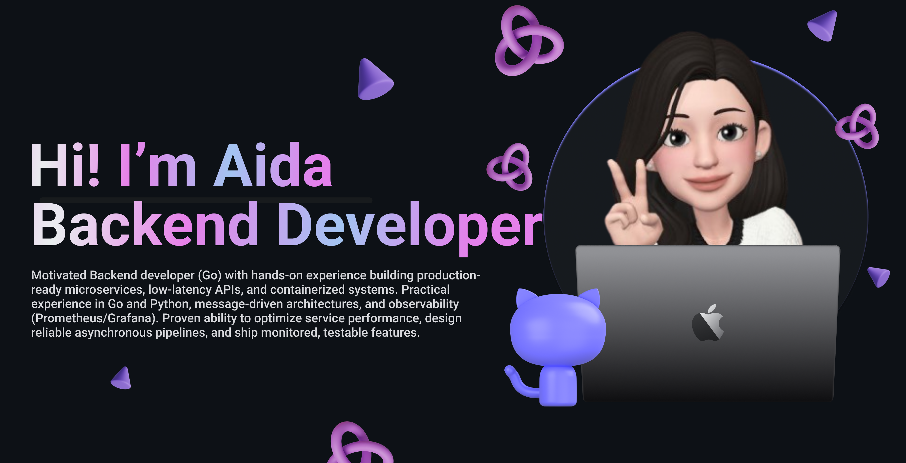

<!--Banner-->

<!--Night Owl image-->

  

<!--Header Name-->
  

<!--Start Intro-->

Building <strong>reliable backend systems</strong> with focus on <strong>clean architecture, scalability & performance</strong>.
  

Specialized in <strong>Go</strong> and modern backend ecosystems: microservices, distributed systems, observability, and cloud-native tooling.

<!-- NEW: Call to Action & Status -->

  💡 Passionate about scalable systems, microservices, and cloud-native architectures. 
  ⚡ Focused on performance, observability, concurrency and clean architecture. 
  🚀 <strong>Actively seeking Backend Development internships and collaborative projects.</strong> 
  <!-- NEW: Mention ML as a secondary skill -->
  🔬 Exploring Machine Learning model deployment and MLOps.

<!--End Intro-->

---

<!--Languages and Tools Section-->
 
<h2 align="center">🛠️ Tᴇᴄʜ Sᴛᴀᴄᴋ & Tᴏᴏʟs</h2>

<!-- UPDATED: Tech Stack with Icons for better visual -->

<table align="center">
  <tr>
    <td valign="top" width="33%">
      <h3>⚡ Programming Languages</h3>
      

        
        
        
        
         
        
        
        
      

      <h3>🌐 Frameworks & Libraries</h3>
      

        
        
        
        
         
        
        
        
      

    </td>
    <td valign="top" width="33%">
      <h3>🗄️ Databases & Messaging</h3>
      

        
        
        
        
         
        
        
        
        
      

      <h3>🔬 ML & Data Science</h3>
      

        
        
        
         
        
        
        
        
      

    </td>
    <td valign="top" width="33%">
      <h3>⚙️ DevOps & Cloud</h3>
      

        
        
        
        
         
        
        
        
        
         
        
        
        
      

      <h3>🔧 Tools & Platforms</h3>
      

        
        
        
      

    </td>
  </tr>
</table>
 

<!-- <picture>
  <source media="(prefers-color-scheme: dark)" src="https://png.pngtree.com/png-vector/20240209/ourmid/pngtree-3d-purple-heart-emoji-white-background-png-image_11734027.png">
  <source media="(prefers-color-scheme: light)" src="https://png.pngtree.com/png-vector/20240209/ourmid/pngtree-3d-purple-heart-emoji-white-background-png-image_11734027.png">
  
</picture> -->
  
<!-- ### ⚡ Languages & Frameworks  

### 🗄️ Databases & Messaging  
          
### ⚙️ DevOps & Cloud  
         
  -->

<!-- NEW: Highlighted Projects Section -->
<h2 align="center">🚀 Featured Projects</h2>

A selection of projects that showcase my capabilities in backend architecture and system design.

<table align="center">
  <tr>
    <td width="50%" valign="top">
      <h3><a href="https://github.com/zhxdoka/QaydaAstana">QaydaAstana</a></h3>
      
Microservices event management platform (Go, gRPC, Kubernetes, Redis, RabbitMQ). Features full observability with Prometheus/Grafana.

    </td>
    <td width="50%" valign="top">
      <h3><a href="https://github.com/zhxdoka/HeyNewsie">HeyNewsie</a></h3>
      
High-throughput Go service with concurrent worker pools, Telegram bot integration, and Prometheus metrics.

    </td>
  </tr>
  <tr>
    <td width="50%" valign="top">
      <h3><a href="https://github.com/zhxdoka/OQYLab">OQYLab</a></h3>
      
The platform was developed as part of a research project analyzing student feedback and survey data, which highlighted a lack of high-quality Kazakh-language IT learning resources.

    </td>
    <td width="50%" valign="top">
      <h3><a href="https://github.com/zhxdoka/StayMate">StayMate</a></h3>
      
hotel management system that simplifies bookings, room and user management, and includes real-time support chat for a seamless hotel experience.

    </td>
  </tr>
  <tr>
    <td width="50%" valign="top">
      <h3><a href="https://github.com/marutm/wheres-my-pizza">Pizza House</a></h3>
      
Restaurant order processing system with RabbitMQ-driven worker pools and real-time tracking.

    </td>
    <td width="50%" valign="top">
      <!-- You can add your 4th project here if you want -->
      <h3><a href="https://github.com/zhxdoka?tab=repositories">Explore More on My Profile!</a></h3>
      
Check out my pinned repositories below for additional projects including ML experiments and other backend systems.

    </td>
  </tr>
</table>
 

<h2 align="center">📫 Cᴏɴɴᴇᴄᴛ Wɪᴛʜ Mᴇ</h2>  

  
    
    
    

  
 

<!--Footer--> 

  

